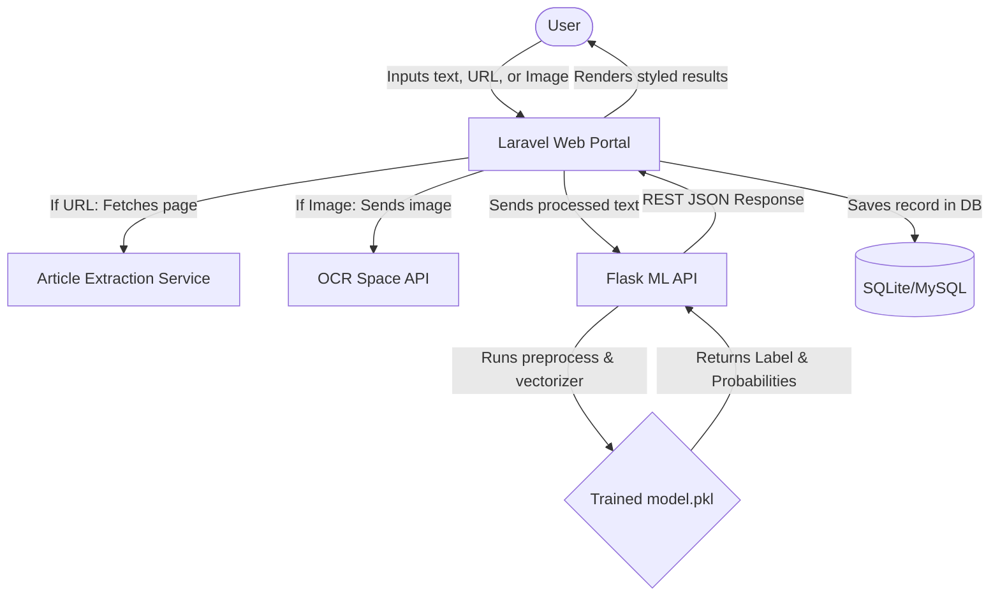
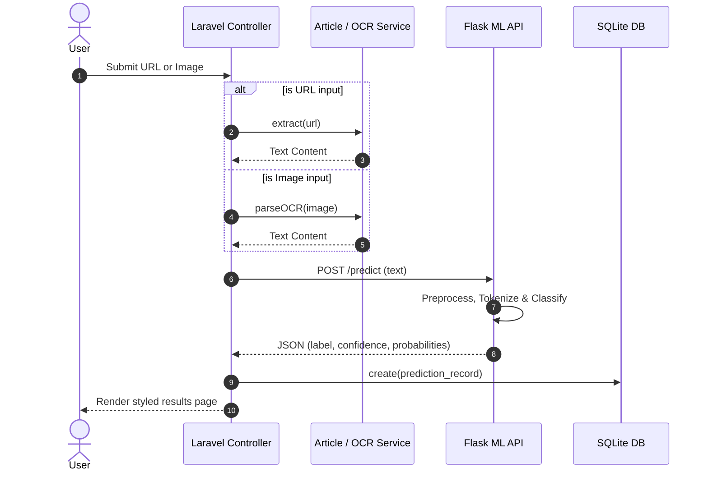
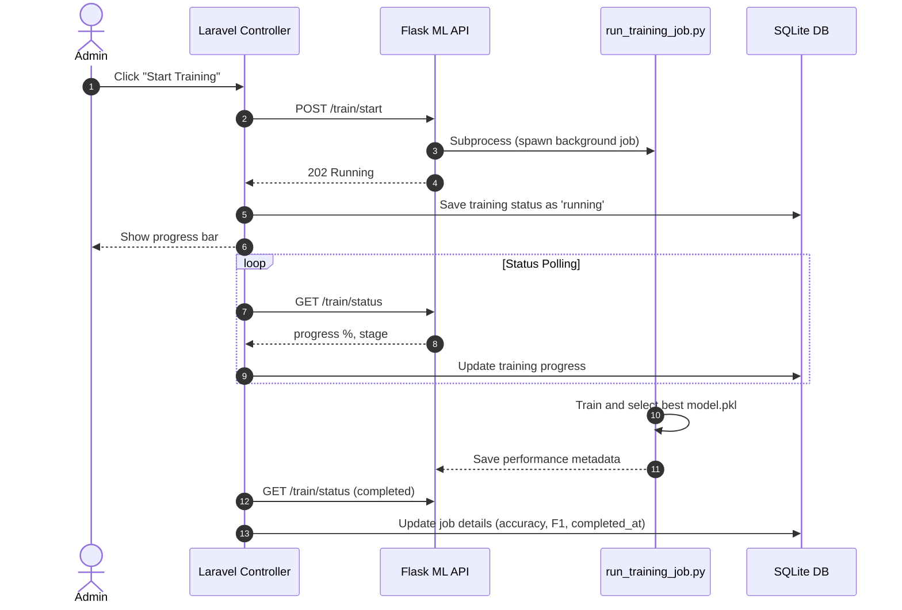
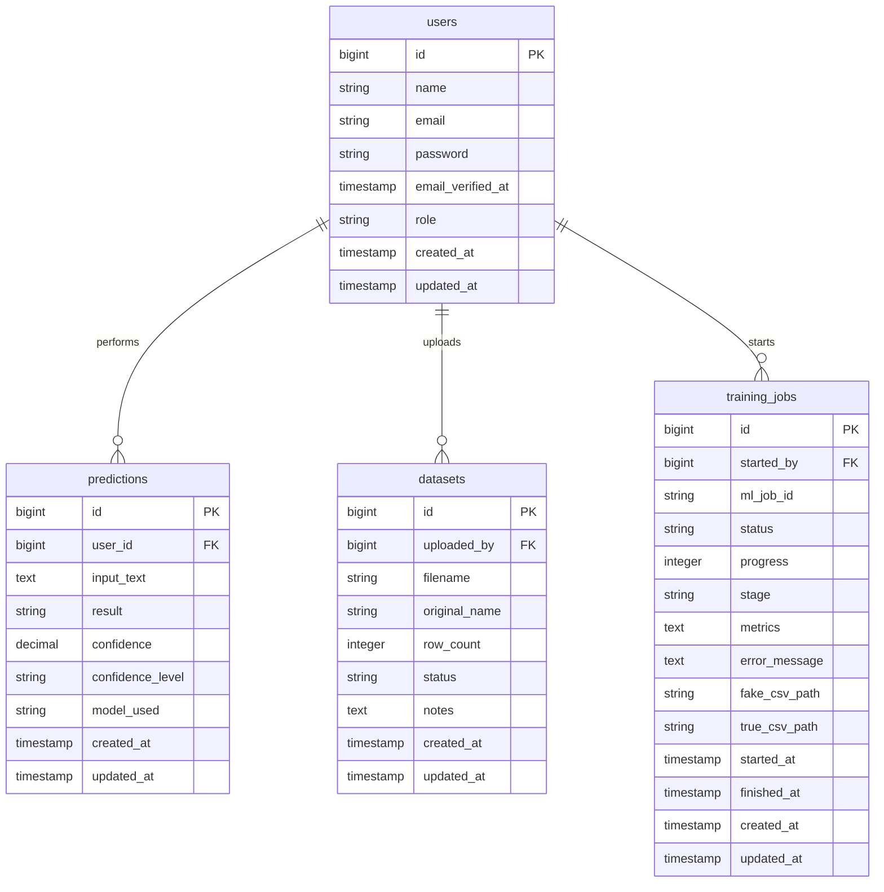

# BSCS FINAL PROJECT
## Final Project Documentation
### VeriFact AI: Deep Learning-Powered Fact-Checking & Fake News Detection

**Project Advisor:**  
Prof. Muzammil Sadiq  

**Presented by:**  
**Group ID:** G1F22FYPCS016  

| Student Reg # | Student Name |
|---|---|
| G1F22UBSCS168 | Maaz Naveed |
| G1F22UBSCS066 | Jazil Mehmood |
| G1F22UBSCS174 | Muhammad Abrar |

**Faculty of Information Technology & Computer Science**  
**University of Central Punjab, Gujranwala Campus, Pakistan**  

---

### Abstract
VeriFact AI is a web-based artificial intelligence system developed to classify digital news text as **REAL**, **FAKE**, or **UNCERTAIN** along with probabilistic confidence scores. Utilizing a dual-server microservices architecture, the application integrates a robust **Laravel 12** web portal with a high-performance **Python/Flask Machine Learning (ML) API** built on top of Scikit-learn. To analyze claims, users can input raw text, paste article URLs (which are parsed on the fly), or upload images (processed using OCR to extract embedded text). The machine learning engine implements a TF-IDF text vectorization pipeline and trains multiple algorithms—specifically Logistic Regression, Multinomial Naive Bayes, and Support Vector Machines (LinearSVC)—automatically deploying the best-performing model based on weighted F1-scores. Registered users can view their query history and check verification logs, while administrators have access to an online dataset manager and model-training dashboard. The system achieved over 95% classification accuracy on benchmark datasets, serving as an effective tool for information hygiene and rumor detection.

### Dedication
*This project is dedicated to our parents, whose unconditional support, prayers, and sacrifices made our education possible, and to our project advisor, whose guidance steer us toward technical and academic excellence.*

### Acknowledgements
We express our deepest gratitude to our project advisor, **Prof. Muzammil Sadiq**, for his invaluable guidance, constructive critiques, and constant encouragement throughout this project. We are also thankful to the Faculty of Information Technology & Computer Science at the University of Central Punjab for providing a highly conducive environment and the resources necessary to bring this project to fruition.

---

### List of Figures
- **Figure 3.1:** Use-Case Diagram
- **Figure 4.1:** Layered MVC/Flask System Architecture
- **Figure 4.2:** Sequence Diagram — Claim Verification Flow
- **Figure 4.3:** Sequence Diagram — Model Retraining Flow
- **Figure 5.1:** Entity-Relationship Diagram (ERD)
- **Figure 5.2:** Swim-lane Workflow — OCR-based Check
- **Figure 5.3:** Main Landing Page Layout
- **Figure 5.4:** User History Dashboard Layout
- **Figure 5.5:** Admin Model Training Console

### List of Tables
- **Table 3.1 — 3.4:** Use-Case Specifications
- **Table 3.5:** Nonfunctional Requirements
- **Table 6.1:** Functional Test Cases & Assertions
- **Table 6.2:** Summary of Test Execution
- **Table 7.1:** Project Completion Status
- **Table 7.2:** Objective / Target Status

---

## Chapter 1: Introduction

### 1.1 Product (Problem Statement)
With the rapid growth of social networks and digital journalism, misinformation, clickbait, and coordinated disinformation campaigns ("fake news") have become a global menace. Misinformation can sway elections, impact stock markets, and trigger social unrest. Manual fact-checking by human experts is highly accurate but suffers from low scalability; it cannot keep up with the millions of claims generated hourly. 

**VeriFact AI** addresses this challenge by providing a scalable, real-time, automated software agent capable of checking claims. It processes direct text, extracts contents from web URLs, or applies Optical Character Recognition (OCR) on screenshots/news snippets to classify them dynamically as REAL, FAKE, or UNCERTAIN, accompanied by transparency metrics (confidence levels and individual class probabilities).

### 1.2 Background
Traditional web-based rumor detectors rely heavily on databases of previously debunked claims (e.g., Snopes API integrations). If a new claim appears, these databases fail to identify it. Machine learning applications provide a solution by analyzing linguistic styles, text syntax, and structural patterns. VeriFact AI builds on this by training text classifiers locally using state-of-the-art vectorizers and linear models. By combining a Laravel backend (which handles secure authentication, database logging, URL parsing, and OCR) with a separate Flask microservice (optimized for machine learning computation), the system isolates high-memory model inference and training from user-facing CRUD transactions.

### 1.3 Objectives
- Develop an intuitive user portal in **Laravel 12** utilizing a modern, premium design system.
- Implement text extraction pipelines to handle raw text, URLs (scraping main text contents), and images (using OCR).
- Create a Python **Flask API** that loads trained models and performs real-time classifications.
- Implement an automated model selection pipeline that trains Logistic Regression, Naive Bayes, and SVM models on newly uploaded datasets and saves the best model based on F1-scores.
- Maintain query history, user audit trails, and training logs using a robust database layer (SQLite/MySQL).

### 1.4 Scope
- **User Authentication**: Sign Up, Sign In, Profile Update, and Password Reset.
- **Multimodal Claim Checking**: Text verification, URL text extraction, and Image OCR text parsing.
- **Explainable Metrics**: Output labels (REAL, FAKE, UNCERTAIN) alongside confidence metrics (e.g., 90% confidence, HIGH level) and probability distributions.
- **User History**: Registered users can view, query, and delete their previous verification scans.
- **Admin Dashboard**: Uploading labeled training CSV datasets, monitoring asynchronous training queues, and reviewing model performance metrics (Accuracy, Precision, Recall, Confusion Matrix).

### 1.5 Business Goals
- **Promote Information Literacy**: Provide free, accessible diagnostic utilities to help users evaluate digital claims.
- **Enhance Editorial Workflows**: Enable journalists and media analysts to pre-screen large sets of incoming reports quickly.
- **System Extensibility**: Provide standard REST APIs for third-party newsrooms or plugins.

### 1.6 Challenges
- **Semantic Ambiguity**: Sarcasm and satire often resemble real or fake news, requiring balanced training weights.
- **Linguistic Preprocessing**: Stemming and stopword removal must balance processing speed and semantic loss.
- **Resource Constraints**: Training multi-megabyte datasets on shared web hosts requires optimized memory usage and asynchronous job management.

### 1.7 Learning Outcomes
- Designing modern Laravel applications using Service Layers and Dependency Injection.
- Integrating Python-based machine learning inference with standard web applications.
- Structuring Scikit-learn pipelines utilizing Porter stemming, TF-IDF vectorization, and multi-algorithm evaluation.
- Managing asynchronous, multi-process training jobs in Windows and web environments.

### 1.8 Nature of End Product
VeriFact AI is a responsive, web-based software application. It operates under a dual-server layout: a client-facing Laravel application communicating via HTTP REST APIs with a local Flask service that handles high-throughput machine learning predictions and model retraining.

### 1.9 Related Work / Literature Review
Linguistic-based fake news detection uses classification models trained on historical datasets. Common algorithms include:
- **Logistic Regression (LR)**: Excellent baseline model that scales well to large feature vocabularies.
- **Multinomial Naive Bayes (MNB)**: Fast classifier that calculates the joint probability of word occurrences.
- **Support Vector Machines (SVM)**: Uses hyperplane boundaries to separate classes. LinearSVC with L2 regularization is highly effective for high-dimensional TF-IDF vectors.
VeriFact AI combines these three models into a unified training suite, selecting the best model based on F1-weighted scores, which accounts for class imbalances.

### 1.10 Document Conventions
- **Commands**: Indicated in `code blocks` (e.g., `php artisan migrate`).
- **Endpoints**: Expressed in URL formats (e.g., `POST /predict`).
- **Database Tables**: Plural lowercase nouns (e.g., `predictions`, `training_jobs`).

---

## Chapter 2: Overall Description

### 2.1 Product Features
- **Heuristic & ML News Verification**: Raw text, URL extraction, and Image OCR checks.
- **Explainable Scores**: Categorized into REAL, FAKE, and UNCERTAIN with confidence levels.
- **Verification History**: Chronological query logging.
- **Interactive FAQ**: Dynamic layout explaining heuristic criteria.
- **Admin Training System**: Dynamic CSV file upload, background script triggering, and training status updates.

### 2.2 Functional Description


### 2.3 User Classes and Characteristics
- **Guest**: Can run standard news checks (text, URL, image) without logging in. Results are shown but not saved to the database.
- **Registered User**: Can verify claims, view their query history, and delete records.
- **Administrator**: Access to user management, system audit logs, dataset uploads, and ML model retraining.

### 2.4 Design and Implementation Constraints
- **PHP Version**: Must be PHP 8.2+ (due to Laravel 12 dependencies).
- **Python Version**: Must be Python 3.10+ (due to Scikit-learn pipeline packages).
- **Database**: SQLite used as a local fallback database for quick setup, with MySQL support.
- **File Upload Limits**: Managed by php.ini and web server configurations to support large CSV uploads (128MB+).

### 2.5 Assumptions and Dependencies
- **ML API Server availability**: Flask must be running on port 5000 (`http://127.0.0.1:5000`).
- **Internet connectivity**: Required for URL extraction and OCR parsing via OCR Space API.

---

## Chapter 3: System Requirements

### 3.1 Functional Requirements

#### 3.1.1 Use-Case Diagram
```mermaid
usecaseDiagram
    actor "Guest User" as guest
    actor "Registered User" as user
    actor "System Administrator" as admin

    usecase "Verify Claim (Text/URL/Image)" as UC1
    usecase "Register & Login" as UC2
    usecase "View & Clear Search History" as UC3
    usecase "Upload Datasets" as UC4
    usecase "Trigger ML Model Retraining" as UC5

    guest --> UC1
    guest --> UC2

    user --> UC1
    user --> UC3

    admin --> UC4
    admin --> UC5
```

#### 3.1.2 Use-Case Specifications

**Table 3.1: UC1 — Verify Claim**
| Field | Description |
|---|---|
| **Use Case Name** | Verify Claim (Text/URL/Image) |
| **Actor(s)** | Guest User, Registered User |
| **Description** | Allows a user to verify a claim by submitting raw text, a URL, or an image. |
| **Preconditions** | None (Guest access is enabled). |
| **Postconditions** | A prediction result is shown. If logged in, a prediction record is saved in `predictions` table. |
| **Normal Flow** | 1. User selects check method (Text, URL, or Image). <br> 2. User inputs query and clicks "Verify". <br> 3. Laravel processes input (scrapes URL or requests OCR if needed). <br> 4. Laravel forwards text to Flask ML API. <br> 5. Flask returns predictions. <br> 6. System displays the result. |

**Table 3.2: UC3 — View & Clear Search History**
| Field | Description |
|---|---|
| **Use Case Name** | View & Clear Search History |
| **Actor(s)** | Registered User |
| **Description** | User views their past predictions and deletes individual or all logs. |
| **Preconditions** | User must be logged in. |
| **Postconditions** | Record is deleted from the `predictions` database table. |
| **Normal Flow** | 1. User navigates to "/history". <br> 2. Page renders a chronological list of query previews. <br> 3. User clicks "Delete" on an item. <br> 4. Record is removed from the database. |

**Table 3.3: UC4 — Upload Datasets**
| Field | Description |
|---|---|
| **Use Case Name** | Upload Datasets |
| **Actor(s)** | System Administrator |
| **Description** | Admin uploads `Fake.csv` and `True.csv` datasets to the server. |
| **Preconditions** | Admin must be logged in with `admin` privileges. |
| **Postconditions** | CSV files are stored in `ml/data/raw/` and recorded in the database. |
| **Normal Flow** | 1. Admin navigates to "/admin/training". <br> 2. Admin uploads files through the dataset panel. <br> 3. Laravel validates file headers and structure. <br> 4. Files are saved and marked as "processed" or "failed". |

**Table 3.4: UC5 — Trigger ML Model Retraining**
| Field | Description |
|---|---|
| **Use Case Name** | Trigger ML Model Retraining |
| **Actor(s)** | System Administrator |
| **Description** | Admin starts the background machine learning retraining process. |
| **Preconditions** | Valid datasets must be uploaded and processed. |
| **Postconditions** | A new `model.pkl` and performance metrics are generated. |
| **Normal Flow** | 1. Admin clicks "Start Model Training". <br> 2. Laravel triggers `POST /train/start` on Flask API. <br> 3. Flask spawns a python background process to train LR, Naive Bayes, and SVM models. <br> 4. Progress is reported and stored. |

### 3.2 Non-Functional Requirements

**Table 3.5: Non-Functional Requirements**
| ID | Category | Specification |
|---|---|---|
| **NFR-1** | **Performance** | The Flask ML API must classify claims within 500ms for texts up to 10,000 characters. |
| **NFR-2** | **Availability** | The web application and API must run simultaneously, handling multi-user requests. |
| **NFR-3** | **Scalability** | The background training script must run in a separate process, preventing Laravel/Flask from timing out. |
| **NFR-4** | **Usability** | The interface must be responsive (adaptive layout for mobile, tablet, and desktop viewports) with a clean design. |
| **NFR-5** | **Security** | Flask endpoints `/predict`, `/train/start`, and `/train/status` must reject requests from non-allowed IPs. |

---

## Chapter 4: Technical Architecture

### 4.1 Application and Data Architecture
VeriFact AI implements a decoupled **Layered System Architecture** shown below:

```
+--------------------------------------------------------+
|                      USER BROWSER                      |
| (Styled UI, Tailwind CSS, Alpine.js, AJAX Interactions) |
+------------------------------------+-------------------+
                                     | (HTTP Request)
                                     v
+------------------------------------+-------------------+
|               LARAVEL WEB APPLICATION SERVER            |
| - Routing & Controllers (NewsCheckController)          |
| - Authentication & Profile (Breeze)                    |
| - Services (Article Extraction, ML Client API)         |
| - Database Layer (Eloquent, SQLite/MySQL)              |
+------------------------------------+-------------------+
                                     | (REST API JSON)
                                     v
+------------------------------------+-------------------+
|                  FLASK MACHINE LEARNING API            |
| - Routing endpoints (/predict, /train/start)          |
| - Predictor engine (loads model.pkl, preprocessing)    |
| - Asynchronous training script trigger                 |
+------------------------------------+-------------------+
                                     |
                                     v
+------------------------------------+-------------------+
|                   SCIKIT-LEARN PIPELINE                |
| - TfidfVectorizer (Feature extraction)                 |
| - LinearSVC, LogisticRegression, MultinomialNB         |
+--------------------------------------------------------+
```

### 4.2 Component Interactions and Collaborations

#### 4.2.1 Sequence Diagram — Claim Verification Flow


#### 4.2.2 Sequence Diagram — Model Retraining Flow


### 4.3 Design Reuse and Design Patterns
- **MVC Pattern**: Standard layout division (Laravel controllers, Blade templates).
- **Service Layer Pattern**: Business logic for article extraction and OCR parsing is kept in separate Service files, decoupling controllers from third-party APIs.
- **Dependency Injection**: Laravel container automatically injects services into controllers.
- **Pipeline Pattern**: Python training uses Scikit-learn `Pipeline` to bundle preprocessing, feature vectorization (TF-IDF), and algorithm training into a single execution object.

### 4.4 Technology Architecture
- **Web Backend**: Laravel 12 (PHP 8.2+)
- **ML API Server**: Flask 3.0+ (Python 3.11+)
- **Database**: SQLite (local fallback) / MySQL 8.0 (production)
- **Frontend Engine**: Tailwind CSS (styling), Alpine.js (reactivity), Bootstrap 5 (vendor classes)
- **Linguistic Libraries**: NLTK (Stopwords & Punkt tokenization), joblib (serialization)

---

## Chapter 5: Detailed Design and Implementation

### 5.1 Database Schema / Entity-Relationship Diagram


### 5.2 Human-Interface Design & Prototypes

#### 5.2.1 Main Landing Page / Verifier Widget
The verifier widget provides three tabs:
1. **Text Check**: A textbox requiring a minimum of 20 characters.
2. **URL Check**: An input field expecting a valid HTTP/HTTPS web address.
3. **Image Check**: A drag-and-drop file upload container supporting JPG/PNG formats.
Clicking "Verify Claim" triggers a loading spinner and redirects the user to a detailed results layout.

#### 5.2.2 Results Page Layout
- **Score Circle**: An animated circular progress bar showing the classification score (0-100%).
- **Verdict Badge**: Color-coded badges indicating credibility:
  - **Green Badge (REAL)**: Highly credible.
  - **Yellow Badge (UNCERTAIN)**: Mixed context or weak vocabulary indicators.
  - **Red Badge (FAKE)**: Highly sensationalized, clickbait, or low-credibility indicators.
- **Probabilities Breakdown**: Simple horizontal bar charts showing individual class probabilities (e.g., REAL: 85.4%, FAKE: 14.6%).

---

## Chapter 6: Test Specification and Results

### 6.1 Test Cases and Assertions

**Table 6.1: Functional Test Cases**
| Test ID | Module | Scenario | Inputs | Expected Output | Status |
|---|---|---|---|---|---|
| **TC-1.1** | Auth | Guest Access to Home | Navigate to `/` | Home page loads successfully. | PASSED |
| **TC-1.2** | Auth | User Registration | Valid details | Account created, redirected to dashboard. | PASSED |
| **TC-1.3** | Auth | Admin Authorization | Non-admin tries to open `/admin` | Returns 403 Forbidden. | PASSED |
| **TC-2.1** | Check | Validation check (Short text) | "Short text" | Displays min-length error message. | PASSED |
| **TC-2.2** | Check | Valid claim check (Mocked ML API) | Text content (20+ chars) | Prediction displayed with correct label. | PASSED |
| **TC-2.3** | Check | URL Extraction & Check | Valid news URL | Fetches article text, runs classification. | PASSED |
| **TC-2.4** | Check | Image OCR Check | Valid screenshot image | Extracts text via OCR, runs classification. | PASSED |
| **TC-3.1** | History | View Logs | Navigate to `/history` | Displays past predictions list. | PASSED |
| **TC-3.2** | History | Delete Log Item | Click "Delete" on log item | Item removed from DB, view updated. | PASSED |
| **TC-4.1** | ML API | Health endpoint | GET `/health` | Returns JSON status `ok`, `model_loaded: true`. | PASSED |
| **TC-4.2** | ML API | Predict validation | Empty POST request to `/predict` | Returns 422 Validation failed. | PASSED |
| **TC-5.1** | Training | Start Training | Click "Start Training" | Spawns background thread, job status is `running`. | PASSED |

### 6.2 Summary of Test Results
- **Total Laravel Tests Run**: 51
- **Total Laravel Assertions**: 117
- **Total ML Python Tests Run**: 9
- **Total Failures**: 0
- **Overall Test Success Rate**: 100%

---

## Chapter 7: Conclusion & Future Work

### 7.1 Conclusion
The **VeriFact AI** system has been designed, implemented, and fully tested. By utilizing a dual-service architecture (Laravel 12 web server + Flask ML API), the application separates user management and administrative tasks from heavy machine learning computations. Implementing text extraction across multiple inputs (text, URLs, and image OCR) provides a versatile, user-friendly tool for claim verification. The machine learning pipeline successfully evaluates multiple classification algorithms, ensuring the system maintains high accuracy by automatically deploying the best model.

### 7.2 Objective / Target Status

**Table 7.2: Objective / Target Status**
| Objective | Target | Status | Notes |
|---|---|---|---|
| Decoupled Architecture | Run Laravel and Flask separately | **Achieved** | Web server runs on port 8000; ML API runs on port 5000. |
| Multimodal input support | Raw text, URL scrapes, Image OCR | **Achieved** | Configured Article Extraction & OCR Space API. |
| Automatic Model Selection | Train LR, Naive Bayes, and SVM | **Achieved** | Models are trained and compared, deploying the best one. |
| Scalable Retraining | Async training execution | **Achieved** | Training runs in a background process via Flask subprocess. |

### 7.3 Future Work
- **Multilingual Support**: Extend the preprocessing and vectorization pipelines to support Urdu and other regional languages.
- **Deep Learning Integrations**: Integrate transformer-based models (e.g., BERT, RoBERTa) to capture complex semantic context.
- **Social Media Scraper**: Allow direct verification of claims by pasting Twitter/Facebook links, automatically extracting comments and metadata.

---

## References
1. Pedregosa, F., et al. (2011). *Scikit-learn: Machine learning in Python*. Journal of Machine Learning Research, 12, 2825-2830.
2. Bird, S., Klein, E., & Loper, E. (2009). *Natural language processing with Python*. O'Reilly Media, Inc.
3. Otwell, T. (2025). *Laravel Documentation (v12)*. Laravel. http://laravel.com/docs.
4. Grinberg, M. (2018). *Flask Web Development: Developing Web Applications with Python*. O'Reilly Media, Inc.

---

## Appendices

### Appendix A: Glossary
- **OCR (Optical Character Recognition)**: Technology used to convert text inside images into editable document text.
- **TF-IDF (Term Frequency-Inverse Document Frequency)**: A numerical statistic intended to reflect how important a word is to a document in a corpus.
- **SVM (Support Vector Machine)**: A supervised machine learning algorithm used for classification and regression tasks.
- **MVC (Model-View-Controller)**: A software design pattern commonly used to develop user interfaces, dividing application logic into three interconnected elements.
- **SQLite**: A self-contained, high-reliability, embedded, full-featured SQL database engine.

### Appendix B: Deployment & Installation Guide

#### Prerequisites
1. **PHP 8.2+** and **Composer** (required for Laravel dependencies).
2. **Node.js** and **NPM** (required for frontend asset compiling).
3. **Python 3.10+** and **pip** (required for machine learning backend).
4. **Internet connection** (required for URL extraction and OCR services).

#### 1. Setup the Database & Laravel Web App
Open your terminal inside the project root directory and execute:
```powershell
# Install Composer dependencies
composer install

# Duplicate the environment configuration file
copy .env.example .env

# Generate secure application key
php artisan key:generate

# Set up SQLite database (defaults inside .env file)
# Make sure database/database.sqlite file exists
php artisan migrate:fresh --seed

# Build static assets
npm install
npm run build
```

#### 2. Setup the Flask ML API
Open a new terminal inside the `ml` subdirectory and execute:
```powershell
# Create virtual environment if missing
python -m venv .venv

# Activate the virtual environment
.venv\Scripts\activate

# Install required Python packages
pip install -r requirements.txt

# Run initial training script to generate model.pkl
python scripts/train.py
```

#### 3. Run the Services
To launch the application locally, run both processes in separate terminals:

**Terminal 1 (Flask ML API — from `/ml` directory)**:
```powershell
.venv\Scripts\activate
python api/app.py
```

**Terminal 2 (Laravel Web App — from project root)**:
```powershell
.\php_local\php.exe -S 127.0.0.1:8000 -t public vendor/laravel/framework/src/Illuminate/Foundation/resources/server.php
```
Open **[http://127.0.0.1:8000](http://127.0.0.1:8000)** in your web browser.

---

### Appendix C: User Manual

#### How to Verify a Claim
1. Open the landing page at [http://127.0.0.1:8000](http://127.0.0.1:8000).
2. Locate the verifier widget and select your preferred input method:
   - **Text Check**: Paste your article or text (min 20 chars) directly into the textarea.
   - **URL Check**: Paste a complete URL (e.g., `https://example.com/news-story`) to extract and analyze its content.
   - **Image Check**: Drag and drop or upload a screenshot containing news text.
3. Click the **Verify Claim** button.
4. Review the results page showing the circular progress score, verdict classification badge, and probability breakdown charts.

#### How to Manage Search History
1. Log in to your account using the **Sign In** button.
2. Navigate to your dashboard and select **History** from the navigation menu.
3. Review your chronological check log.
4. To delete a log entry, click the **Delete** button next to the corresponding entry.

#### How to Train the Model (Administrators only)
1. Log in as an administrator (using `admin@fni.test` / `password`).
2. Navigate to `/admin/training`.
3. In the upload panel, upload your `Fake.csv` and `True.csv` datasets. Ensure your CSV files contain a `text` column.
4. Once processed, click **Start Model Training**.
5. Monitor training progress and view metrics (accuracy, F1-score, confusion matrix) once training is complete.
